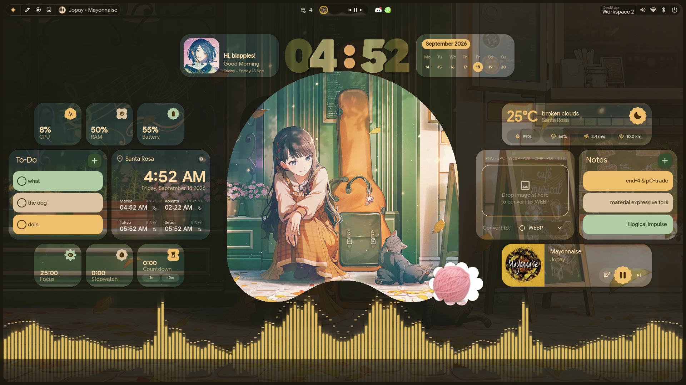

<div align="center">

# 💠 end4-pC

**A personal fork of [illogical-impulse](https://github.com/end-4/dots-hyprland) by [@end-4](https://github.com/end-4)**  
Customized and maintained by **pctrade**

[English](README.md) | [简体中文](README.zh-CN.md) | [日本語](README.ja.md)

</div>

---

## 🎬 Showcase

<p align="center">
  <a href="https://www.youtube.com/watch?v=o0Vsh7eVchs">
    
  </a>
</p>

</div>

---

## 📸 Screenshots
<div align="center">

| 🎵 Lyrics | 🖼️ Online Wallpapers |
|:---:|:---:|
|  |  |
| 🪟 Desktop Widgets | 🔧 Hyprland Configs |
|  |  |
| ⚙️ Configurable Bar | ✨ And More |
|  |  |

</div>

---

## ⚡ Installation

> [!NOTE]
> This fork manages its own configuration folder independently — it does **not** overwrite or modify any existing setup. However, it does require [illogical-impulse](https://github.com/end-4/dots-hyprland) to be installed and running.

```bash
cd ~/.config/quickshell/
git clone https://github.com/pctrade/end4-pC.git
killall qs 2>/dev/null; qs -c end4-pC > /dev/null 2>&1 & disown
```

### 🎨 Post-install: Enable Cheatsheet Keybinds

After cloning, run this to install keybinds with full cheatsheet descriptions:

```bash
bash ~/.config/quickshell/end4-pC/scripts/hyprland/install-keybinds.sh
hyprctl reload
```

This copies `defaults/hypr/hyprland/keybinds.lua` (with complete description fields) to `~/.config/hypr/hyprland/keybinds.lua`. Your existing file is backed up to `keybinds.lua.bak`.

> [!TIP]
> Open the cheatsheet with `Super + /` to see all available keybinds.

### 🔧 Set as your default shell (optional)

If you like it and want it to load by default instead of `ii`, edit:

```bash
~/.config/hypr/hyprland/variables.lua
```

And change this line:

```lua
hl.env("qsConfig", "ii")
```

to:

```lua
hl.env("qsConfig", "end4-pC")
```

> [!TIP]
> After saving, restart Hyprland or run `hyprctl reload` to apply the change.

---

## ✨ Features Added in This Fork

### 🎹 Cheatsheet
- Ported from upstream end-4, adapted to the tree-based `HyprlandKeybinds` API
- Handles pseudo-binds (loop-generated keybinds like arrow keys)
- Modifier icons (Super, Shift, Ctrl, Alt) with symbol map support
- Custom keybinds from `~/.config/hypr/custom/keybinds.lua` are loaded automatically

### 🖥️ Quick Layout (Display Settings)
- One-click monitor positioning presets: Above / Below / Left / Right
- Alignment controls: Horizontal (Left/Center/Right), Vertical (Top/Middle/Bottom)
- Utilities: Swap monitors, Center layout, Reset layout
- Adjustable gap control (default: 0px)
- Windows-style magnetic drag docking — monitors snap flush on release
- Viewport auto-centers after preset changes

### 🖼️ Multi Custom Image
- Add multiple custom images to the desktop background
- Per-image shape (Circle, Heart, Cookie, etc.), size, and position
- Drag-drop images onto desktop widgets, or use the file picker in Settings
- Per-image delete button (red X on hover)
- Smooth resize animation
- Right-click desktop → "Add Custom Image" to pick a file

### ⚙️ Settings keybind

To open the settings panel, add this to your Hyprland config:

```lua
hl.bind("SUPER + escape", hl.dsp.global("quickshell:settingsToggle"), {description = "Toggle settings"})
```

> **Note:** Settings is an overlay panel, not a regular window — `Super + Q` won't close it. Use the same keybind to toggle it or press `Escape`.

## 🙏 Credits

Huge thanks to the people who made this possible:

- **[@end-4](https://github.com/end-4)** — for creating the original [dots-hyprland](https://github.com/end-4/dots-hyprland) / illogical-impulse shell. An absolute masterpiece of a dotfiles project 🫡
- **[@gh0stzk](https://github.com/gh0stzk)** — for providing the weather API integration that made the weather widget possible 🙌
- **[@StarS2112](https://github.com/StarS2112)** — for showcasing this fork 🙌

---

<div align="center">

Made with ❤️ — feel free to fork and make it your own

</div>
